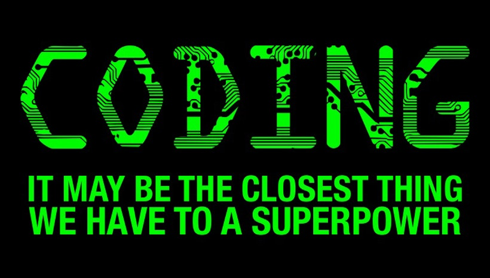
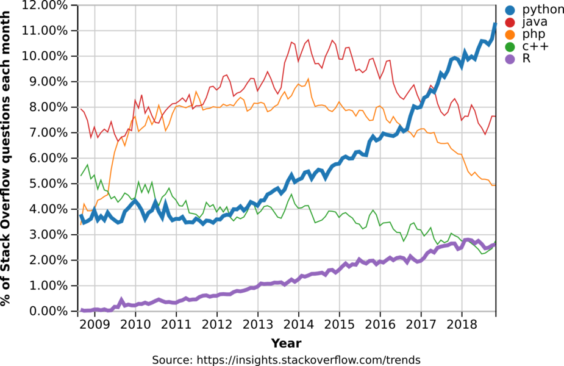
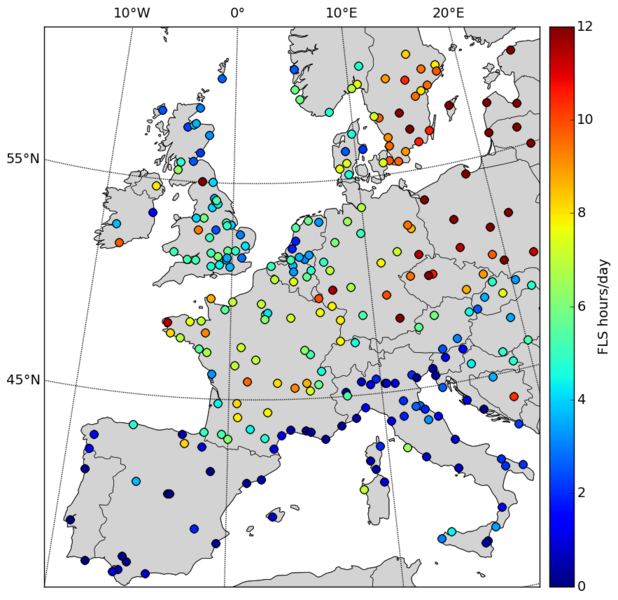
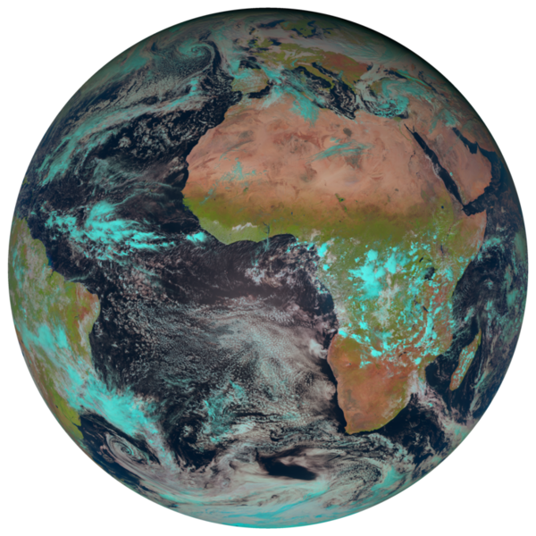

{::options parse_block_html="true" /}

    
# Motivation


{::options parse_block_html="true" /}


{::options parse_block_html="true" /}

    
## Why coding?


{::options parse_block_html="true" /}


{::options parse_block_html="true" /}

    



{::options parse_block_html="true" /}


{::options parse_block_html="true" /}

    
Coding enables you to...
- automate your processes,
- work efficiently (especially with large data sets),
- do exactly what you want to do!


{::options parse_block_html="true" /}


{::options parse_block_html="true" /}

    
## Why Python?


{::options parse_block_html="true" /}


{::options parse_block_html="true" /}

    



{::options parse_block_html="true" /}


{::options parse_block_html="true" /}

    
> Python is an unusual case for being both one of the **most visited** tags on Stack Overflow and one of the **fastest-growing** ones. (Incidentally, it is also accelerating! Its year-over-year growth has become faster each year since 2013). Source: [StackOverflow Blog](https://stackoverflow.blog/2017/09/06/incredible-growth-python/)

Python...
- is beginner friendly,
- flexible,
- readable,
- has a big onliny community,
- is a first-class tool for scientific computing tasks, including the analysis and visualization of large datasets,
- is used in
    - Remote Sensing
    - Machine Learning
    - Big Data
    - Image Processing
    - Data Analysis
    - Data Visualization


- is the 2nd most demanded programming skill (in the US)
- is the 2nd best paid programming skill (> 105'000$ in the US)
- is heavily used at large companies like Google & Facebook but also at NASA, ESA, EUMETSAT, etc.

----------


{::options parse_block_html="true" /}


{::options parse_block_html="true" /}

    
## Aim of the course

**At the end of this course you will be able to...**


{::options parse_block_html="true" /}


{::options parse_block_html="true" /}

    
**... work with the basic concepts of Python:**


{::options parse_block_html="true" /}


{:.input_area}
```python
print("Hallo Welt!")
```


{:.output .output_stream}
```
Hallo Welt!

```


{::options parse_block_html="true" /}

    
**... use standard Python tools for data science (numpy, scipy, pandas, matplotlib):**


{::options parse_block_html="true" /}


{:.input_area}
```python
import numpy as np
import matplotlib.pyplot as plt

plt.plot(np.linspace(0,10,100),np.random.random(100)+np.linspace(0,3,100))
plt.show()
```


{:.output .output_png}


{::options parse_block_html="true" /}

    
**... visualize your data in map plots:**




{::options parse_block_html="true" /}


{::options parse_block_html="true" /}

    
**... read, manipulate and visualize meteorological satellite data (e.g. Meteosat):**




{::options parse_block_html="true" /}

